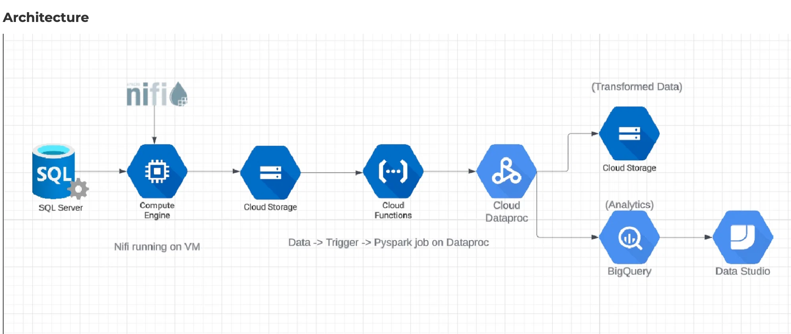

# ETL_Pipeline_for_Financial_Data_Analytics

I build an ETL Pipeline for financial data analytics using GCP-IaC

# Tech Stacks used for this project

- Programming Language

* Python
* SQL

- Cloud Services Used

* SQL Server
* AWS RDS
* GCP Compute Engine
* GCP Cloud Functions
* Apache NiFi
* GCP Cloud Storage
* GCP BigQuery
* GCP Dataproc
* GCP Deployment Manager

# Aim

The aim of this project is to build an ETL pipeline for the Financial Data Set on GCP, enabling the extraction, transformation, and loading of data from a SQL server to BigQuery for analytics purposes.

